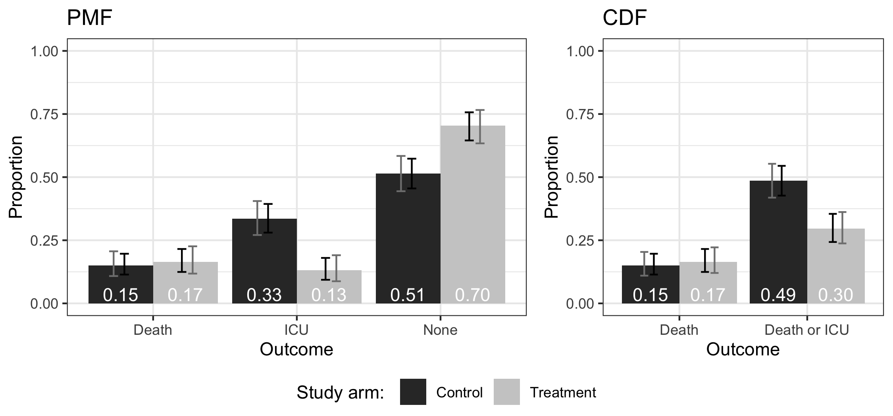

```{r xaringan-themer, include=FALSE, warning=FALSE}
library(xaringanthemer)

extra_css <- list(
  ".inverse" = list(
    `background-size` = "cover"
    ),
  ".small" =  list(`font-size` = "80%"),
  ".tiny" =  list(`font-size` = "70%"),
  ".large" =  list(`font-size` = "150%"),
  ".huge" =  list(`font-size` = "300%"),
  "ul li" = list(`margin-bottom` = "10px"),
  ".gray" = list(color = "#C0C0C0"),
  ".red" = list(color = "#FF0000"),
  ".blue1" = list(color = "#0033a0"),
  ".blue2" = list(color = "#007dba"),
  ".green" = list(color = "#348338"),
  ".mutedred" = list(color = "#745344"),
  "a" = list(color = "#007dba"),
  "a:hover" = list("text-decoration" = "underline")
)

style_mono_accent(
  base_color = "#012169",
  header_font_google = google_font("DM Sans"),
  text_font_google   = google_font("DM Sans", "400", "400i"),
  code_font_google   = google_font("Courier Prime"),
  extra_css = extra_css
)
```

<style type="text/css">
.remark-slide-content {
    font-size: 22px
}
</style>

## The Dream Team

Joint work with:

* Iván Díaz (Weill-Cornell) and Alex Luedtke (UW) (co-first authors)
* Dan Scharfstein (Utah)
* Jodi Segal and Michael Rosenblum (JHU)

Benkeser, D., Díaz, I., Luedtke, A., Segal, J., Scharfstein, D., and Rosenblum, M. 
Improving Precision and Power in Randomized Trials for COVID-19 Treatments Using Covariate Adjustment, for Binary, Ordinal, or Time to Event Outcomes. *Biometrics*. doi: [10.1111/biom.13377](https://doi.org/10.1111/biom.13377)

Slides based on talk given by M. Rosenblum at SCT2020, D. Benkeser at ENAR2021.

---

## Motivation

* Over __800 randomized clinical trials__ (phase 2 and 3) of COVID-19 treatments registered on clinicaltrials.gov.
* March 2020: Request by the __U.S. Food and Drug Administration__ (FDA) for statistical analysis recommendation
for __COVID-19 treatment trials__.
* Primary outcomes in these trials often: __binary, ordinal, time-to-event__.
* We assessed potential value added by __covariate adjustment__ by simulating two-arm trials with 1:1 randomization
 comparing a hypothetical COVID-19 treatment versus standard of care.
* Simulations derived from data on over __500 patients hospitalized__ at New York Presbyterian Hospital, 
and a Centers for Disease Control and Prevention (CDC) preliminary description of 2449 cases.
* Submitted report in April, 2020, to FDA.

---

## Problem and goals

__Covariate adjustment in randomized trial:__
* Preplanned adjustment for baseline variables when estimating average or conditional treatment effect in primary efficacy analysis.
* Reduce required sample size to achieve desired power.

.red[Covariate adjustment often misunderstood and underutilized.]

Our goals:
* Describe common marginal estimands, covariate-adjusted estimators, and implementation in R packages for these outcome types.
* Use simulations based on real data to demonstrate impact of covariate adjustment in hypothetical COVID-19 trials.
* Provide practical recommendations for implementation.

---

## Main results

* The estimators that we consider are .green[robust to model misspecification].
* .green[Substantial precision gains] from using covariate adjustment.
* Equivalent to .green[4-18% reductions in required sample size] to achieve a desired power.
* Results shown for .green[a variety of estimands and sample sizes].
* We provide an R package and practical recommendations for implementing covariate adjustment.
* Excellent discussion from [Proschan](https://onlinelibrary.wiley.com/doi/full/10.1111/biom.13493), [LaVange](https://onlinelibrary.wiley.com/doi/full/10.1111/biom.13494), [Zhang and Zhang](https://onlinelibrary.wiley.com/doi/full/10.1111/biom.13492).

---

background-color: #012169
class: title-slide, center, inverse, middle

<h1> Background </h1>

---

background-color: #84754e
class: title-slide, left, inverse, middle

*The statistical emphasis on covariate adjustment is quite complex and often poorly understood, and there remains confusion as to what is an appropriate statistical strategy.*

<a href = 'https://doi.org/10.1002/sim.1296' style = 'color: white; font-size: 80%'>Pocock et al. (2002)</a>

<br> 

*A substantial and confusing variation exists in handling of baseline covariates in randomized controlled trials: a review of trials published in leading medical journals.*

<a href = 'https://doi.org/10.1016/j.jclinepi.2009.06.002' style = 'color: white; font-size: 80%'>Austin et al. (2010)</a>

---

## Regulatory guidance

__ICH E9 Statistical Principles for Clinical Trials (1998)__

* *Pretrial deliberations should identify [covariates] expected to have an important influence on the [outcome], and should consider how to account for these in the analysis to improve precision.* 

__FDA draft guidance for continuous outcomes (2019)__
* *Sponsors can use ANCOVA to adjust for differences between treatment groups in relevant baseline variables to improve the power of [tests] and the precision of estimates of treatment effect* 

__FDA Guidance on COVID-19 treatment and prevention trials (2020)__
* *To improve the precision [...] sponsors should consider adjusting for prespecified prognostic baseline covariates [...] in the primary efficacy analysis and should propose methods of covariate adjustment.*

---

## Related work

__Many__ statisticians have sung the praises of covariate adjustment.

[Yang and Tsiatis, 2001](https://doi.org/10.1198/000313001753272466); [Zhang et al. 2008](https://doi.org/10.1111/j.1541-0420.2007.00976.x); [Tsiatis et al. 2008](10.1002/sim.3113); [Rubin and van der Laan, 2008](https://www.ncbi.nlm.nih.gov/pmc/articles/PMC2669310/); [Zhang and Gilbert 2010](https://doi.org/10.2202/1948-4690.1002); [Moore et al. 2011](https://doi.org/10.1002/sim.4301); [Tian et al. 2012](https://doi.org/10.1093/biostatistics/kxr050); [Zhang 2014](https://doi.org/10.1007/s10985-014-9291-y); [Zheng et al. 2015](https://biostats.bepress.com/ucbbiostat/paper339/); [Vermuelen et al. 2015](https://doi.org/10.1002/sim.6386); 
[Wager et al. 2016](https://doi.org/10.1073/pnas.1614732113); [Zhang and Ma, 2019](https://doi.org/10.1002/sim.8054); [Jiang et al. 2019](https://doi.org/10.1080/01621459.2018.1527226).

---

background-color: #012169
class: title-slide, center, inverse, middle

<h1> Methods </h1>

---

## Estimands

We focus on __marginal (ITT) treatment effects__ -- contrasts between outcome distributions if all were assigned to treatment versus control. 

__Binary outcomes:__

* risk difference/ratio, odds ratio.

__Ordinal outcomes:__

* difference in means, Mann-Whitney\*, 
average cumulative log-odds ratio.

__Survival outcomes:__ 
* difference in restricted mean survival <time></time>, difference/ratio in survival probabilities


.footnote[\* = probability that outcome under treatment is better than outcome under control with ties broken at random]

---

## Estimands

Because treatment is .green[randomized], marginal effects can be estimated using .green[simple estimators].

* E.g., sample proportions/means, Mann-Whitney U statistic, Kaplan-Meier

.red[However], these approaches .red[ignore prognositc baseline variables]. Incorporating such variables .green[improves precision].

* In the case of missing outcomes, can also weaken censoring assumptions.

We present a covariate-adjusted estimator of each estimand that leverages prognostic variables. 
* For ordinal outcomes, novel covariate adjusted estimators.

---

## Examples

For each estimand, we adopt the following approach:

1\. Fit a .green[covariate-conditional working model] for outcome distribution.

* E.g., logistic regression for binary outcomes
* E.g., proportional odds model for ordinal outcomes
* E.g., proportional hazards model for survival outcomes

2\. Use empirical covariate distribution to .green[marginalize the estimated treatment-specific distribution].

3\. Compute desired .green[summary measure] of marginalized distribution.

---

## Examples

For example, suppose the trial enrolls $n$ patients on whom we measure: 
* $W$ a single covariate;
* $A = 1$ a randomized treatment, $A = 0$ a control treatment;
* $Y$ a binary outcome of interest.

1\. Fit a .green[covariate-conditional working model] for outcome distribution.

E.g., logistic regression model: $$\hat{P}(Y = 1 \ | \ A = a, W = w) = \mbox{logit}^{-1}(\hat{\beta_0} + \hat{\beta_1} a + \hat{\beta_2} w) \ .$$

The implied treatment-specific conditional distribution estimates are $$\begin{align} \hat{P}(Y = 1 \ | \ A = 1, W = w) &= \mbox{logit}^{-1}(\hat{\beta_0} + \hat{\beta_1} + \hat{\beta_2} W) \\ \hat{P}(Y = 1 \ | \ A = 0, W = w) &= \mbox{logit}^{-1}(\hat{\beta_0}  + \hat{\beta_2} W)\end{align}$$

---

## Examples

2\. Use empirical covariate distribution to .green[marginalize the estimated treatment-specific distribution].

Marginalized estimate for treatment-specific distribution:
$$\begin{align}\hat{p}_1 &= \hat{E}\{\hat{P}(Y = 1 \ | \ A = 1, W)\} \\ &= \frac{1}{n}\sum_{i=1}^n \mbox{logit}^{-1}(\hat{\beta_0} + \hat{\beta_1} + \hat{\beta_2} W_i)\end{align}$$

Marginalized estimate for control-specific distribution:
$$\begin{align} \hat{p}_0 &= \hat{E}\{\hat{P}(Y = 1 \ | \ A = 0, W)\} \\ &= \frac{1}{n}\sum_{i=1}^n \mbox{logit}^{-1}(\hat{\beta_0} + \hat{\beta_2} W_i) \end{align}$$

---

## Examples

3\. Compute desired .green[summary measure] of marginalized distribution.

* Risk difference
$$\widehat{\text{RD}} = \hat{p}_1 - \hat{p}_0$$

* Risk ratio
$$\widehat{\text{RR}} = \frac{\hat{p}_1}{\hat{p}_0}$$

* Odds ratios
$$\widehat{\text{OR}} = \frac{\hat{p}_1 / (1 - \hat{p}_1)}{\hat{p}_0 / (1 - \hat{p}_0)}$$

---

## Examples

For example, consider as before a trial that enrolls $n$ patients with covariates $W$ treatment $A$ and 
* $Y$ an .red[ordinal] outcome of interest with $K$ levels.

1\. Fit<sup>\*</sup> a .green[covariate-conditional working model] for outcome distribution.

E.g., proportional odds model. For $j = 1, \dots, K-1$, $$\hat{P}(Y \le j \ | \ A = a, W = w) = \mbox{logit}^{-1}(\hat{\alpha_j} + \hat{\beta_1} a + \hat{\beta_2} w) \ .$$

The implied treatment-specific conditional distribution estimates are $$\begin{align} \hat{P}(Y \le j \ | \ A = 1, W = w) &= \mbox{logit}^{-1}(\hat{\alpha_j} + \hat{\beta_1} + \hat{\beta_2} W) \\ \hat{P}(Y \le j \ | \ A = 0, W = w) &= \mbox{logit}^{-1}(\hat{\alpha_j}  + \hat{\beta_2} W)\end{align}$$

.footnote[<sup>\*</sup>Technical note: more efficient to *not* use maximum likelihood in this step]

---

## Examples

2\. Use empirical covariate distribution to .green[marginalize the estimated treatment-specific distribution].

Marginalized estimate for treatment-specific cumulative distribution:
$$\begin{align}\hat{F}_1(j) &= \hat{E}\{\hat{P}(Y \le j \ | \ A = 1, W)\} \\ &= \frac{1}{n}\sum_{i=1}^n \mbox{logit}^{-1}(\hat{\alpha_j} + \hat{\beta_1} + \hat{\beta_2} W_i)\end{align}$$

Marginalized estimate for control-specific cumulative distribution:
$$\begin{align} \hat{F}_0(j) &= \hat{E}\{\hat{P}(Y \le j \ | \ A = 0, W)\} \\ &= \frac{1}{n}\sum_{i=1}^n \mbox{logit}^{-1}(\hat{\alpha_j} + \hat{\beta_2} W_i) \end{align}$$

---

## Examples

3\. Compute desired .green[summary measure] of marginalized distribution.

Let $\hat{f}_a(j) = \hat{F}_a(j) - \hat{F}_a(j-1)$ be the estimate of the marginalized density.

.pull-left[
* Log-odds ratios
$$\widehat{\text{LOR}} = \sum_{j=1}^{K-1} \mbox{log}\left[\frac{\hat{F}_1(j)/\{1 - \hat{F}_1(j)\}}{\hat{F}_0(j)/\{1 - \hat{F}_0(j)\}} \right]$$

* Mann Whitney estimand:
$$\widehat{\text{MW}} = \sum_{j=1}^K \left\{\hat{F}_0(j-1) + \frac{1}{2} \hat{f}_0(j) \right\}\hat{f}_1(j)$$
]

.pull-right[
* Difference in means
$$\widehat{\text{DIM}} = \sum_{j=1}^K j \ \{ \hat{f}_1(j) - \hat{f}_0(j) \}$$
]

---

## Notes on examples

The previous examples are .red[overly simplistic]. In practice, we may want to:

* include __more covariates__;
* include treatment X covariate __interactions__;
* fit __separate working models__ in each treatment group;
* use __alternative estimators__ of conditional distributions.

The estimators are .green[robust to misspecification] of the working model.

* BUT, better fitting working models = greater efficiency

---

## Estimands

Some prefer __conditional treatment effects__ -- contrasts between outcome distributions in subgroups comparing treatment to control.

* Generally, .red[assume treatment effect is constant] across subgroups.
* See [discussion here](https://www.fharrell.com/post/ipp/).

Reasons why we focused on __marginal estimands__:

* The most common estimand in many COVID contexts.
* Easy to ignore covariates when estimating marginal estimands.
* Model-free estimand, flexible modeling of effects with stable inference.

---

## Simulations (survival outcomes)

Patient data re-sampled with replacement from 500 patients hospitalized at Weill Cornell Medicine New York Presbyterian Hospital.

* Simulated __sample sizes__ n = 100, 200, 500, and 1000. 
* Hypothetical __treatment variable__ drawn independent of all other data
* To simulate positive __treatment effect__: add independent draw from a $\chi^2$ with 4 d.f. to each treatment arm participant's outcome
* __Censoring__: 5% censored completely at random; censoring time from uniform distribution on 1,...,14.

---

## Simulations (ordinal outcomes)

Patient data distribution mimicks distribution from hospitalized, COVID-19 positive patients in [CDC MMWR](https://www.cdc.gov/mmwr/volumes/69/wr/mm6912e2.htm). 

* __Ordinal outcome__: 1=death; 2=survival with ICU admission; 3=survival without ICU admission. 
* __Baseline variable__: Age category.
* Simulated __sample sizes__ n = 100, 200, 500, and 1000. 
* Hypothetical __treatment variable__ drawn independent of all other data.
* Simulated treatment __impacted ICU admission__, but not death.
* __No censoring__ (though methods can handle)

---
background-color: #012169
class: title-slide, center, inverse, middle

<h1> Results </h1>

---

## Results (survival outcomes)

.pull-left[

__Restricted Mean Survival Time__ 

|      n | Est. | Power | MSE | RE |
|:-------|:----------|:-----:|:---:|:--:|
|100  | Unadj. | 0.09 | 53.7 | 1.00 |
|100  | Adj.   |  0.15 | 51.0  | 0.95 |
|200  | Unadj. | 0.33 | 62.7  | 1.00 |
|200  | Adj.   |  0.40 | 56.4  | 0.90 |
|500  | Unadj. | 0.74 | 72.9  | 1.00 |
|500  | Adj.   | 0.82 | 62.2  | 0.85 |
|1000 | Unadj. |  0.96 | 76.5  | 1.00 |
|1000 | Adj.   |  0.98 | 63.5   | 0.83 | 

]

.pull-right[

<br> 

* True effect = reduction in 1 day
* Improved MSE (mostly due to variance) and power at all sample sizes.
* 5-17% reduction in sample size possible to achieve same power as with unadjusted estimator.
* Similar results observed for all survival estimands.

]

---

## Results (ordinal outcomes)

.pull-left[

__Difference in Means__

| n | Est. | Effect | Power | MSE |  RE |  
|:-------|:----------|:-----:|:---:|:--:|:--:|
| 100 | Unadj. | 0.30 | 0.47 | 2.2 |  1.00 |
| 100 | Adj. | 0.30 | 0.55 | 1.9 |  0.85 |
| 200 | Unadj. | 0.30 | 0.78 | 1.2 |  1.00 |
| 200 | Adj. | 0.30 | 0.84 | 1.0 | 0.87 |
| 500 | Unadj. | 0.20 | 0.81 | 0.5 | 1.00 |
| 500 | Adj. | 0.20 | 0.86 | 0.4 |  0.89 |
| 1000 | Unadj. | 0.14 | 0.84 | 0.2 | 1.00 |
| 1000 | Adj. | 0.14 | 0.87 | 0.2 | 0.89 |

]

.pull-right[

<br> 

* True effect chosen so that t-test has close to 80% power. 
* Improved MSE (mostly due to variance) and power at all sample sizes.
* 11-15% reduction in sample size possible to achieve same power as with unadjusted estimator.
* Similar results observed for all other ordinal and binary estimands.

]

---

## Software

`R` packages
* Ordinal Outcomes: [`drord`](https://github.com/benkeser/drord)
* Survival Outcomes: [`survtmlerct`](https://github.com/idiazst/survtmlerct)

---

## Other recommendations

__Estimand when the outcome is ordinal__ 
* .green[+] difference between means or Mann-Whitney 
* .red[-] log odds ratios

__Covariate adjustment__
* .green[+] Adjust for prognostic baseline variables.
* Approach should be specified before the trial is started 

__Confidence intervals (CI) and hypothesis testing__ 
* .green[+] Nonparametric bootstrap (BCa), 10,000 replicates for CI.
* Hypothesis tests: invert confidence interval or permutation.

---

## Other recommendations

__Use Information Monitoring__

* Final analysis time based on the information accrued. 
* Precision gains from covariate adjustment translate into faster information accrual and shorter trial duration.
* [Monoclonal antibody substudies of ACTIV-3 trial discontinued](https://www.niaid.nih.gov/news-events/statement-nih-sponsored-activ-3-clinical-trial-closes-enrollment-two-sub-studies) for futility based on severity-adjusted analysis.
* [Tech report by Tsiatis et al.](https://arxiv.org/abs/2106.15559) - methods for interim analysis of ordinal outcomes when outcomes are censored at interim analysis.

__Missing covariates__

* Impute based only on data from observed covariates. 

__Missing outcomes__ 

* Use doubly robust methods and sensitivity analyses.

---

## Other recommendations

__Plot CDF and PMF when outcome is ordinal__

* Covariate adjusted estimate for each study arm.
* Pointwise and simultaneous confidence intervals displayed.



---

background-color: #012169
class: title-slide, center, inverse, middle

<h1> Questions? </h1>
